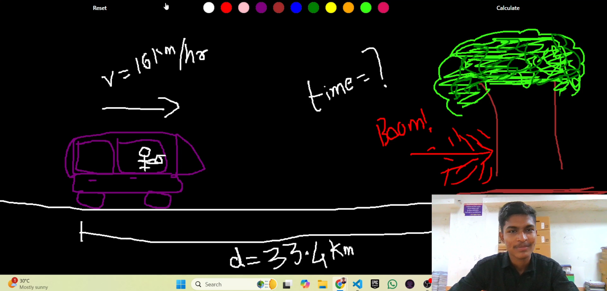

# AI Calculator ✏️➕📐

Welcome to the AI Calculator GitHub repository! This AI-powered calculator allows users to write or draw mathematical and physics questions, providing accurate answers instantly at the click of a button. Designed with an intuitive, interactive interface, it brings a seamless experience for solving complex equations and scientific problems.

## Features 🌟
- **Handwritten Input Recognition**: Supports handwritten or drawn input for math and physics questions.
- **Instant Calculation**: Simply press "Calculate" to receive an answer instantly.
- **User-Friendly Interface**: Designed to provide an interactive and easy-to-navigate experience.
- **Wide Range of Topics**: Ideal for both mathematical and physics-related questions, covering basic to advanced problems.

## Tech Stack 🛠️
- **Python**: Core programming language for AI Calculator functionalities.
- **Machine Learning Models**: Recognizes handwritten input and processes complex calculations.
- **UI Framework**: Provides a smooth and interactive front-end experience.
